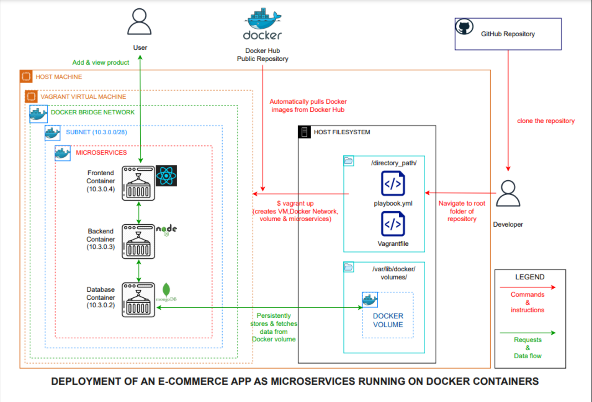

# Overview
This project involved the deployment of a containerized e-commerce application into a Vagrant VM using Ansible.

# Requirements
Make sure that you have the following installed:
- [Vagrant](https://developer.hashicorp.com/vagrant/tutorials/getting-started/getting-started-install)
- [Virtualbox](https://docs.oracle.com/en/virtualization/virtualbox/7.0/user/installation.html#installation)
- [Ansible](https://docs.ansible.com/ansible/2.9/installation_guide/intro_installation.html)

## How to launch the application 

### Method 2
- Clone this repository to your local machine

  `git clone https://github.com/MrMiano-SecOps/yolo`

- Navigate to the root directory of your cloned repository

  `cd yolo`

- Launch the vagrant virtual machine and the application

  `vagrant up`

## Access the application on your browser using the following URL
 `http://localhost:3000/`

## How to destroy the application
 `ansible-playbook playbook.yml --tags destroy`

## How to re-create the application completely
 `ansible-playbook playbook.yml --tags create`

## How to delete the entire virtual machine
 `vagrant destroy`

# Structure of the Playbook
The [playbook.yml](https://github.com/MrMiano-SecOps/yolo/blob/master/playbook.yml) file
has been divided into [roles](https://docs.ansible.com/ansible/latest/playbook_guide/playbooks_reuse_roles.html) containing specific [tasks](https://www.digitalocean.com/community/tutorials/how-to-define-tasks-in-ansible-playbooks) that fulfill the role.

The roles have been designed for re-usability through the use of [variables](https://docs.ansible.com/ansible/latest/playbook_guide/playbooks_variables.html). The variables are defined in the /vars sub-folders of each role. This allows easier modification of the playbook to suit your desired environment.

# Description of the playbook roles and tasks
Since Ansible playbooks execute sequentially, the roles have been ordered to cater for this
limitation.
## install_docker_ubuntu
- This role installs the required dependencies for running the application
- Its primary goal is to install Docker into the virtual machine

##  docker_bridge
- This role creates a custom bridge network for the application's Docker containers.
- The network lays the foundation for the containers to communicate.

##  docker_volume
- This role creates a docker volume to help persist data stored by the database container.

##  docker_db_container
- This role creates the mongodb database container and links it to the docker volume and
  connects it to the docker network previously created.
- An additional block has also been specified to facilitate deletion when specified.

##  docker_backend_container
- This role creates the nodejs backend container and connects it to the docker network
  previously created.
- An additional block has also been specified to facilitate deletion when specified using
  the "never" and "destroy" tags.

## docker_frontend_container
- This role creates the react frontend container and connects it to the docker network
  previously created.
- An additional block has also been specified to facilitate deletion when specified using
  the "never" and "destroy" tags.

## post_task
- This additional step is primarily for the purpose of deleting the docker volume when
  required.
- This has been done since Docker containers have to be deleted first before deleting their
  respective containers.